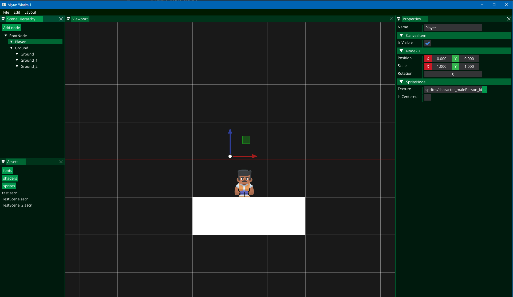

# Akytos

A simple 2D game engine created with .NET 6 using OpenGL and ImGui. The design of the engine is largely based on Godot, as I felt that the Mono version of Godot barely takes advantage of the capabilities of C# and its design philosophy.

Full disclaimer, this is probably not a game engine you would want to use at this point :) It is merely for educational purposes.

# Features (so far)
 - Engine features
   - Node-oriented architecture
   - Texture rendering
   - Inversion-of-Control with LightInject
 - Editor features
   - Simple viewport navigation
     - Right-click to drag
     - Scroll to zoom in/out
   - Node manipulation
     - Transformation gizmos
     - Property panel
       - Displays all fields marked with the [SerializeField] attribute!
   - Simple asset browser
     - Folder navigation
     - Drag and drop textures to Sprite nodes
